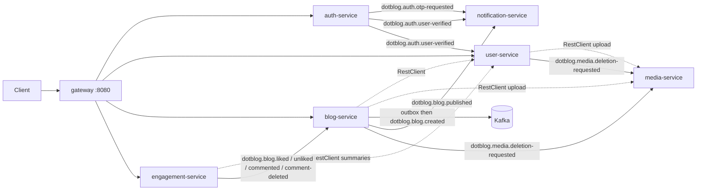

# Dot-Blog Java backend

Blog platform API: users, posts, likes/comments, media, and email. Java 21, Spring Boot 3.2.5, MongoDB, Apache Kafka (KRaft). Seven Spring Boot apps plus `shared/api-contract` and `shared/events`. Public HTTP is `/api/v2/*` on the gateway. Cross-service work after a write goes through Kafka (OTP, welcome mail, publish, media delete, engagement counters, blog-created outbox).

| Module | Default port | Role |
|--------|-------------:|------|
| `gateway` | 8080 | Spring Cloud Gateway. CORS + `/api/v2/*` routing. No Kafka. |
| `auth-service` | 8081 | Register, login, OTP, password reset, JWT issue. Publishes `SendOtpEvent` and `UserVerifiedEvent`. |
| `user-service` | 8082 | Profile, photos. Consumes `UserVerifiedEvent` to seed `users`. Publishes `MediaDeletionRequestedEvent`. |
| `blog-service` | 8083 | Blog CRUD, publish, soft-delete. Outbox for `BlogCreatedEvent`. Publishes `BlogPublishedEvent` and media-deletion. Consumes engagement events to maintain `LikesCount` / `CommentsCount`. |
| `engagement-service` | 8084 | Like / unlike / comment. Source of truth is the `engagements` collection. Publishes like/comment events. |
| `media-service` | 8085 | Only holder of Cloudinary credentials. Consumes deletion events (`/internal/upload` and `/internal/delete` are HTTP for siblings). |
| `notification-service` | 8086 | OTP email, welcome email, in-memory published-blog search index. Not in `docker-compose.yml` or `render.yaml`. |
| `shared/api-contract` | — | Request/response DTOs. |
| `shared/events` | — | Kafka payload types (listed below). |

Public HTTP goes through the gateway. `media-service` and `notification-service` are not on gateway routes. Kafka UI is published at `localhost:8090` when you run compose.

---

## Architecture

The client talks HTTP to the gateway. Services talk to each other over RestClient for reads/uploads and Kafka for events.



### Event catalogue (`shared/events`)

`DeliveryChannel` is an enum (`EMAIL`, `SMS`, `PUSH`), not a Kafka payload by itself.

| Event | Topic (default) | Producer | Consumer | What the consumer does |
|---|---|---|---|---|
| `SendOtpEvent` | `dotblog.auth.otp-requested` | auth-service (`OtpEventPublisher`, key = `userId`) | notification-service (`notification-service`) | Send OTP / reset email via Resend. Failed sends go to DLT after retries. |
| *(same payload, DLT)* | `dotblog.auth.otp-requested.DLT` | notification-service `DeadLetterPublishingRecoverer` | `OtpEventDltListener` (`notification-service-dlt`) | Log only. Comment in code: never auto-reprocess. |
| `UserVerifiedEvent` | `dotblog.auth.user-verified` | auth-service (`UserVerifiedEventPublisher`, key = `userId`) | notification-service group `notification-service`; user-service group `user-service-profile-seed` | Welcome email; `$set` name/email on `users` with `$setOnInsert` for `about`. |
| `BlogPublishedEvent` | `dotblog.blog.published` | blog-service (`BlogEventPublisher.publish`, key = `blogId`) | notification-service group `notification-service-search` | Upsert in-memory `BlogSearchIndex`. Query: `GET /internal/search?q=`. |
| `BlogCreatedEvent` | `dotblog.blog.created` | blog-service `OutboxRelay` → `publishCreatedAndWait` (key = `blogId`) | **none in this repo** | Event is produced. `user.posts` is still updated by HTTP `appendPost` after the Mongo commit. |
| `MediaDeletionRequestedEvent` | `dotblog.media.deletion-requested` | blog-service and user-service (key = `publicId`) | media-service group `media-service-deletion` | Cloudinary delete. Invalid ids skip retry. |
| `BlogLikedEvent` | `dotblog.blog.liked` | engagement-service (key = `blogId`) | blog-service group `blog-service-engagement-projection` | `$inc LikesCount` after claiming `eventId`. |
| `BlogUnlikedEvent` | `dotblog.blog.unliked` | engagement-service (only if `$pull` modified a row) | same projection group | `$inc LikesCount -1` where `LikesCount > 0`. |
| `BlogCommentedEvent` | `dotblog.blog.commented` | engagement-service | same | `$inc CommentsCount`. |
| `BlogCommentDeletedEvent` | `dotblog.blog.comment-deleted` | engagement-service | same | `$inc CommentsCount -1` where `CommentsCount > 0`. |

Producer keys: OTP and user-verified use `userId`; blog/engagement events use `blogId`; media deletion uses `publicId`. Broker default in compose is 3 partitions (`KAFKA_NUM_PARTITIONS`).

Bootstrap for every Kafka client is `${KAFKA_BOOTSTRAP_SERVERS:localhost:29092}`. Compose Kafka advertises `EXTERNAL://localhost:29092` for the host and `PLAINTEXT://kafka:9092` for the docker network. Compose Java services do **not** set `KAFKA_BOOTSTRAP_SERVERS`, so Kafka consumers work for `mvn spring-boot:run` on the host, not for those JVMs inside compose.

---

## Event-driven design

### Transactional outbox (blog create)

**Problem:** Saving a blog in Mongo and publishing `BlogCreatedEvent` are two writes. A crash between them leaves a blog with no event.

**How:** `BlogService.persistBlogAndOutbox` writes the `blogs` document and an `outbox_events` row (`status=PENDING`, `_id` = `eventId`, payload = `BlogCreatedEvent`) inside a `TransactionTemplate` when Mongo is a replica set (Atlas). Standalone Mongo (compose `mongo:7` with no replica set) cannot start a transaction; the code catches that and writes the two documents sequentially, with a warning.

`OutboxRelay` runs `@Scheduled(fixedDelayString = "${dotblog.outbox.poll-ms:2000}")`. It loads PENDING rows, then `findAndModify` `PENDING` → `PUBLISHING` so two overlapping ticks cannot both send. It publishes with `KafkaTemplate.send(...).get(15, TimeUnit.SECONDS)` and only then sets `PUBLISHED`. On send failure it sets `PENDING` again.

If the process dies after the claim and before `markPublished` / `markPending`, the row stays `PUBLISHING` and is never selected again. There is no reclaim timeout.

### Consumer idempotency

**Problem:** Kafka redelivers. Counter `$inc` and OTP email are not naturally idempotent.

**How (engagement projection):** `EngagementProjectionListener.claim` `insert`s into `processed_events` with `_id = eventId` *before* `$inc`. `DuplicateKeyException` means skip. Unlike/delete also require `LikesCount` / `CommentsCount` `gt(0)` so a stray event cannot drive the stored count negative.

**How (OTP):** `OtpEventListener` checks `existsById` first, sends mail, then `insert`s. Two in-flight deliveries can both pass `existsById` and both send; the second `insert` logs `dedup insert race lost`. That is weaker than the projection's insert-first claim.

Welcome email and the search-index listener do not use `processed_events`. Search upserts by `blogId`, so a redelivery overwrites the same entry.

### Retry and DLT (OTP)

**Problem:** Resend can fail transiently. A poison payload should not block the partition forever, and a human should see what gave up.

**How:** `notification-service` `KafkaConsumerConfig` installs `DefaultErrorHandler` + `DeadLetterPublishingRecoverer` onto `dotblog.auth.otp-requested.DLT`, same partition when possible. Backoff is `FixedBackOff(2000L, 3L)` (three retries, 2s apart), then DLT.

`OtpEventDltListener` uses group `notification-service-dlt`, not `notification-service`. It logs a payload snippet and exception header. The method comment says not to re-process automatically.

### Non-retryable poison (media delete)

**Problem:** A structurally invalid Cloudinary `publicId` will never succeed. Spending the full retry budget (minutes) on it only delays other deletes.

**How:** `MediaDeletionEventListener` `@RetryableTopic(attempts = "6", backoff delay 30s × 2.0, dltStrategy = FAIL_ON_ERROR, exclude = InvalidPublicIdException.class)`. Transient Cloudinary failures throw `IllegalStateException` and retry. `FAIL_ON_ERROR` means DLT handler failure is not swallowed. `@DltHandler` logs; it does not retry Cloudinary again.

### `ErrorHandlingDeserializer`

**Problem:** A JSON blob that cannot become the event type would otherwise crash the listener thread and stall the consumer.

**How:** notification-service, user-service, and blog-service set

`value-deserializer: org.springframework.kafka.support.serializer.ErrorHandlingDeserializer`

with `spring.deserializer.value.delegate.class` = `JsonDeserializer` and `spring.json.trusted.packages: com.dotblog.events`.

media-service's `application.yml` sets `JsonDeserializer` as the value deserializer (not `ErrorHandlingDeserializer`), with the same trusted package and `MediaDeletionRequestedEvent` default type.

### Engagement as a read-model projection

**Problem:** Listing a blog should not scan like/comment arrays, and engagement-service should not own blog documents.

**How:** Likes and comments are written to `engagements` (`_id` = blogId). `blogs` is read only to check the post exists. After a successful write, engagement-service publishes. blog-service updates `LikesCount` / `CommentsCount` (the `@Field` names on `Blog`). List/detail HTTP hydrates like/comment arrays from `engagements` in the same Mongo. Counts on `getBlog` come from the projection fields, so they lag the write by one Kafka hop.

Engagement produce is still dual-write (Mongo then `KafkaTemplate.send` without waiting). Unlike is gated on `modifiedCount > 0` so a no-op unlike does not emit.

---

## Design decisions and trade-offs

- **Outbox only on blog create.** `BlogCreatedEvent` is written to `outbox_events` with the blog document. OTP, welcome, publish, media delete, and engagement still publish from the request/listener thread after (or beside) Mongo. Those paths can lose or duplicate a message if the process dies between the two writes.
- **Shared Mongo.** Auth and user default to database `dotblog`. Blog and engagement default to `dotblog_blog` (likes/comments used to live on `blogs`; engagement still checks that collection for existence). One Atlas `DATABASE_URI` can point both at the same cluster. Compose uses two database names.
- **JSON events, no schema registry.** Payloads are Jackson records in `shared/events`. Several types use `@JsonIgnoreProperties(ignoreUnknown = true)` so new fields (for example `tags` on `BlogPublishedEvent`) do not break old consumers.
- **Internal HTTP is unauthenticated.** media-service `/internal/upload` and `/internal/delete` have no auth. notification-service search is `GET /internal/search`.

---

## Prerequisites

- Java 21
- Maven 3.8+ or `./mvnw`
- Docker + Docker Compose (Mongo 7, Kafka 3.9.2, Kafka UI — and the six services listed in compose)
- MongoDB URI (Atlas or local)
- Resend API key (OTP / welcome / reset mail)
- Cloudinary cloud name, key, secret (media-service)

---

## Quick start (Docker)

Compose starts Mongo, Kafka, Kafka UI, gateway, auth, user, blog, engagement, media. It does not start notification-service.

Both `env.example` and `.env.example` exist. `.env.example` is the commented template.

```bash
cp .env.example .env
# Set DATABASE_URI, JWT_SECRET, TWO_WAY_SECRET, RESEND_API_KEY, SENDER_MAIL_ID,
# FRONTEND_URL, CLOUD_NAME, CLOUDINARY_API_KEY, CLOUDINARY_API_SECRET.

docker compose up -d --build
docker compose ps
curl http://localhost:8080/actuator/health
```

Kafka UI: `http://localhost:8090`. To consume OTP/welcome/search, run notification-service on the host:

```bash
./mvnw -pl notification-service -am spring-boot:run
```

Tear down:

```bash
docker compose down       # keep mongodb_data
docker compose down -v    # wipe local Mongo
```

## Quick start (Maven, no Docker)

Needs Mongo and Kafka already listening (`DATABASE_URI`, broker `localhost:29092` unless you override `KAFKA_BOOTSTRAP_SERVERS`). Each module loads `../.env` via spring-dotenv unless `SPRINGDOTENV_ENABLED=false`.

```bash
./mvnw clean install -DskipTests

( cd gateway              && ../mvnw spring-boot:run )
( cd auth-service         && ../mvnw spring-boot:run )
( cd user-service         && ../mvnw spring-boot:run )
( cd blog-service         && ../mvnw spring-boot:run )
( cd engagement-service   && ../mvnw spring-boot:run )
( cd media-service        && ../mvnw spring-boot:run )
( cd notification-service && ../mvnw spring-boot:run )
```

`scripts/start-all.sh` does not start media-service or notification-service.

---

## Environment variables

All of these are listed in `.env.example`. Compose also substitutes `DATABASE_URI` with a container Mongo URL when the variable is unset.

| Variable | Read by | Purpose |
|----------|---------|---------|
| `DATABASE_URI` | auth, user, blog, engagement, notification | Mongo URI. Auth/user/notification default DB name `dotblog`; blog/engagement default `dotblog_blog`. |
| `JWT_SECRET` | auth, user, blog, engagement | HMAC secret. Auth signs; the others verify. Same value everywhere or tokens fail. |
| `TWO_WAY_SECRET` | auth | Symmetric key used when encrypting OTP payloads. |
| `RESEND_API_KEY` | notification (`app.email.api-key`); needed for OTP/welcome | Resend. |
| `SENDER_MAIL_ID` | notification | From address. |
| `FRONTEND_URL` | notification | Password-reset links. |
| `CLOUD_NAME` / `CLOUDINARY_API_KEY` / `CLOUDINARY_API_SECRET` | media-service | Cloudinary. |
| `KAFKA_BOOTSTRAP_SERVERS` | every Kafka client | Defaults to `localhost:29092`. |
| `USER_SERVICE_URI` | blog, engagement | Author summaries / `appendPost`. |
| `MEDIA_SERVICE_URI` | blog, user | Upload HTTP. |
| `BLOG_SERVICE_URI` | user | Author published-blog lists. |
| `AUTH_SERVICE_URI` / `USER_SERVICE_URI` / `BLOG_SERVICE_URI` / `ENGAGEMENT_SERVICE_URI` | gateway | Route targets. |
| `CHAOS_FAIL_AFTER_BLOG_PERSIST` | blog-service (`ChaosProperties`) | If true, throw after blog+outbox commit. Not in `application.yml`; bind via env if you use it. |
| `PORT` | every service | Bind port (Render). |

---

## Verifying the stack

```bash
curl http://localhost:8080/actuator/health

for p in 8081 8082 8083 8084 8085 8086; do
  echo "$p:"; curl -s "http://localhost:$p/actuator/health" || true
done

./scripts/smoke.sh
```

`scripts/smoke.sh` hits the gateway: register, login, `isAuthenticated`, create blog, publish (`{"Blogid":...}`), list, like, comment (`/add-commnet` — that spelling is the route), owner delete, 404/403 checks. Steps are numbered 0–16. `BASE_URL` defaults to `http://localhost:8080`.

Kafka is not part of the smoke script. Check topics in Kafka UI or with the broker's topic list.

---

## Testing

```bash
./mvnw test                    # effectively auth-service
./mvnw test -pl auth-service
```

Auth unit tests mock Kafka publishers. Integration tests use Testcontainers MongoDB, not Kafka.

```bash
BASE_URL=http://localhost:8080 ./scripts/test-auth-curl.sh
./scripts/smoke.sh
```

---

## Troubleshooting

| Symptom | Likely cause | Fix |
|---|---|---|
| OTP / welcome never arrive | `notification-service` is not running, or broker is wrong | Run the module on the host; set `KAFKA_BOOTSTRAP_SERVERS`. Compose does not start this service. |
| Kafka consumers work on the host but not in compose | `KAFKA_BOOTSTRAP_SERVERS` still `localhost:29092` inside the container | Point compose services at `kafka:9092`. |
| `createBlog` warns about replica set | Local Mongo is standalone | Expected in compose. Atlas (replica set) uses a real transaction. |
| Like count on GET does not move | Projection consumer down, or field name mismatch | blog-service must be in group `blog-service-engagement-projection`; it `$inc`s `LikesCount` / `CommentsCount`. |
| Gateway 401 on authenticated routes | `JWT_SECRET` differs across services | Align the secret; users must log in again. |
| Atlas `MongoSocketException` | IP not in Network Access | Allow the current IP. |
| Publish returns “Blogid required” | Body key is `Blogid` | `smoke.sh` already sends that key. |
| Media `/internal/*` reachable on Render | Free-tier Web Service, no auth on those routes | Documented in `render.yaml`. Do not treat that as locked down. |

Gateway routes (from `gateway/.../application.yml`): auth (`register`, `verify`, `login`, OTP, reset), user (`Author`, about, photos), blog (CRUD, publish, lists, thumbnail), engagement (`like-post`, `dislike-post`, `add-commnet`, `delete-comment`).
